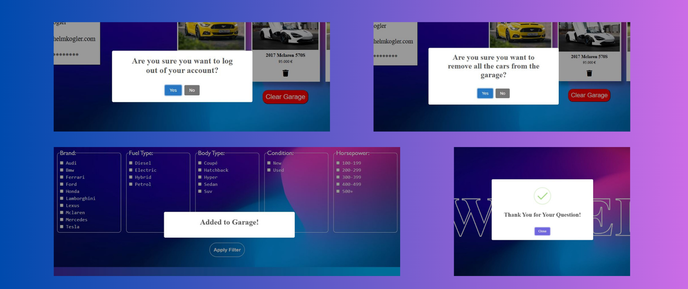
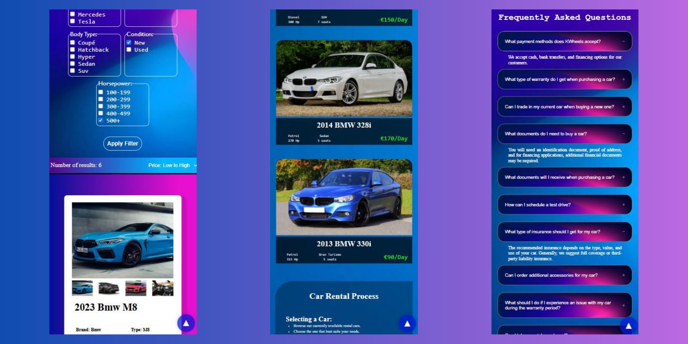

<body>
    
<h1>🚘 Car Dealership Web Application </h1>


<p align="justify">This web app named 'KWheels' allows users to browse cars from a custom-built database, using various filtering and sorting options. Users have the ability to create an account, log in, and add their favorite cars to a personal garage. There is a FAQ section to help answer common questions, and if the user doesn't find what they're looking for, they can submit their own question through a contact form. There is also a loan calculator available to make it easier to estimate car financing.
</p>


<h2>Features</h2>

<ul>
    <li>Filtering cars by various attributes (brand, year, fuel type, performance, etc.)</li>
    <li>Sorting cars by data (year, price, mileage, etc.)</li>
    <li>Switching between multiple car images</li>
    <li>Registering a personal account through a validated form</li>
    <li>Logged-in users can add favorite cars to their garage</li>
    <li>Users can delete cars from their garage individually or clear the entire list at once</li>
    <li>Google Maps integration</li>
    <li>Animated FAQ section</li>
    <li>Form for submitting custom questions</li>
    <li>Loan calculator for faster and easier financing calculations</li>
    <li>User-friendly pop-up messages</li>
</ul>


<h2>Tech Stack</h2>

<p>Front-End: HTML, CSS, Bootstrap, jQuery, JavaScript </p>

<p>Back-End: PHP </p>

<p>Database: MySQL </p>

<h2>Cars displayed</h2>
<h3>Filters</h3>
 
<h3>Rental Cars</h3>

<h3>Cars For Sale</h3>


<p align="justify">This section showcases the vehicles that are available for both purchase and rental. Users can easily browse through the listings using various filter and sorting options based on specific criteria. Each car is presented with high-quality images and detailed specifications to help users make informed decisions. The entire section was built using CSS for styling, PHP for backend logic, and SQL queries to fetch data from a MySQL database. The cars are dynamically displayed, allowing for real-time updates and seamless interaction with the content.</p>


<h2>Question Form</h2>


<p align="justify">On the home page, there is a custom question submission form where users can ask their own questions. These messages are sent directly to the site administrator's email address provided in the backend. This feature was implemented using a PHP library called PHPMailer, which handles the secure and reliable sending of emails.

</p>


<h2>Loan Calculator</h2>


<p align="justify">This section is to help users better and more quickly understand their financing options. By entering just a few details—such as the full price of the car, the interest rate, the down payment (either as an amount or a percentage), and the loan term—users can instantly calculate their estimated monthly installment. With the click of a button, the monthly payment is displayed. This feature was built using JavaScript and jQuery to ensure smooth and interactive functionality.</p>


<h2>Contact Page</h2>


<p align="justify">On the contact page, visitors can find a short description of the dealership's address, opening hours, and contact details. To make it easier for users to locate the dealership, an integrated Google Map is also included on the page.</p>


<h2>User Account & Profile</h2>
<h3>Register / Login</h3>


<p align="justify">Users can create an account by filling out a registration form, which includes input validation to prevent incorrect or irrelevant data from being submitted. If a username or email already exists in the system, the user receives a notification. Upon providing valid information, the user's data is stored in the database, and their password is securely encrypted. During login, the system verifies the credentials to ensure that the user exists, and if the check is successful, grants access to the platform. This functionality is implemented using PHP and JavaScript.</p>

<h3>Personal Profile</h3>


<p align="justify">After a successful login, users can add their favorite cars to their personal garage, which they can access later at any time. Cars in the garage can be removed individually by clicking the trash bin icons, or the entire garage can be cleared with a single button click. This functionality is powered by SQL queries and implemented using PHP.</p>


<h2>Pop-up Messages</h2>

<div align="center">
    
</div>

<p align="justify">Instead of the usual outdated and dull pop-up windows, this application uses modern, user-friendly alerts to enhance the user experience. These notifications inform users about various actions—for example, when a car has been successfully added to their garage or when a question has been submitted via the form. They also prompt users to confirm important decisions, such as whether they really want to log out or delete their entire garage. This feature was implemented using a JavaScript library called SweetAlert, which provides customizable and visually appealing alert dialogs.

</p>

<h2>Responsive Design</h2>

<div align="center">
    
</div>

<p align="justify">The entire web application places a strong emphasis on responsive design, ensuring a user-friendly and visually appealing layout across all screen sizes—including smartphones, tablets, and both smaller and larger desktop monitors. On mobile devices and tablets, the layout is primarily vertical to suit smaller screens, while horizontal layout adjustments were made for larger screens. These responsive behaviors were achieved using CSS Flexbox for flexible and adaptive design.</p>

<h2>Installation</h2>

<p align="justify">In order to execute the application, a relational database must be utilized with the help of MySQL, which enables the structured storage, retrieval, and management of the website’s data. The use of phpMyAdmin is recommended for the creation and configuration of the database schema and its corresponding tables. For optimal demonstration and to ensure the visual and functional integrity of the application, it is advisable to pre-populate the tables with relevant sample data.
    The following SQL code snippet can be used to generate the necessary database structure and insert demo records accordingly:
</p>


```bash
CREATE DATABASE IF NOT EXISTS `kwheels` DEFAULT CHARACTER SET utf8mb4 COLLATE utf8mb4_general_ci;
USE `kwheels`;

DROP TABLE IF EXISTS `kwheels`;


CREATE TABLE `cars` (
  `Id` int(20) NOT NULL,
  `Brand` varchar(50) NOT NULL,
  `Type` varchar(50) NOT NULL,
  `Year` int(20) NOT NULL,
  `Fuel` varchar(50) NOT NULL,
  `Engine` int(20) NOT NULL,
  `Horsepower` int(20) NOT NULL,
  `Mileage` int(20) NOT NULL,
  `Body` varchar(50) NOT NULL,
  `Status` varchar(50) NOT NULL,
  `Transmission` varchar(50) NOT NULL,
  `Price` int(20) NOT NULL,
  `Pic1` varchar(50) NOT NULL,
  `Pic2` varchar(50) NOT NULL,
  `Pic3` varchar(50) NOT NULL,
  `Pic4` varchar(50) NOT NULL
) ENGINE=InnoDB DEFAULT CHARSET=utf8mb4 COLLATE=utf8mb4_general_ci;


INSERT INTO `cars` (`Id`, `Brand`, `Type`, `Year`, `Fuel`, `Engine`, `Horsepower`, `Mileage`, `Body`, `Status`, `Transmission`, `Price`, `Pic1`, `Pic2`, `Pic3`, `Pic4`) VALUES
(1, 'Audi', 'A3', 2014, 'Petrol', 2000, 310, 132000, 'Sedan', 'Used', 'Automatic 8-speed', 15000, 'img/cars/1_1.webp', 'img/cars/1_2.webp', 'img/cars/1_3.webp', 'img/cars/1_4.webp'),
(2, 'Audi', 'Q3', 2013, 'Diesel', 3000, 240, 198000, 'Suv', 'Used', 'Automatic 6-speed', 15000, 'img/cars/2_1.webp', 'img/cars/2_2.webp', 'img/cars/2_3.webp', 'img/cars/2_4.webp'),
(3, 'Audi', 'S5', 2015, 'Petrol', 3000, 400, 58000, 'Sedan', 'Used', 'Automatic 7-speed', 35000, 'img/cars/3_1.webp', 'img/cars/3_2.webp', 'img/cars/3_3.webp', 'img/cars/3_4.webp'),
(4, 'Audi', 'RSQ8', 2019, 'Petrol', 4000, 550, 32000, 'Suv', 'Used', 'Automatic 8-speed', 100000, 'img/cars/4_1.webp', 'img/cars/4_2.webp', 'img/cars/4_3.webp', 'img/cars/4_4.webp'),
(5, 'Audi', 'A6', 2011, 'Diesel', 2000, 140, 260000, 'Sedan', 'Used', 'Manual 6-speed', 10000, 'img/cars/5_1.webp', 'img/cars/5_2.webp', 'img/cars/5_3.webp', 'img/cars/5_4.webp'),
(6, 'Audi', 'RS7', 2023, 'Petrol', 4000, 630, 0, 'Sedan', 'New', 'Automatic 8-speed', 225000, 'img/cars/6_1.webp', 'img/cars/6_2.webp', 'img/cars/6_3.webp', 'img/cars/6_4.webp'),
(7, 'Tesla', 'Model S', 2018, 'Electric', 0, 480, 0, 'Sedan', 'Used', 'Automatic 2-speed', 90000, 'img/cars/7_1.webp', 'img/cars/7_2.webp', 'img/cars/7_3.webp', 'img/cars/7_4.webp'),
(8, 'Tesla', 'Model X', 2022, 'Electric', 0, 640, 0, 'Suv', 'New', 'Automatic 2-speed', 160000, 'img/cars/8_1.webp', 'img/cars/8_2.webp', 'img/cars/8_3.webp', 'img/cars/8_4.webp'),
(9, 'Ferrari', '488', 2018, 'Petrol', 4000, 640, 58000, 'Coupé', 'Used', 'Automatic 8-speed', 140000, 'img/cars/9_1.webp', 'img/cars/9_2.webp', 'img/cars/9_3.webp', 'img/cars/9_4.webp'),
(10, 'Mclaren', '720S', 2023, 'Petrol', 4000, 720, 0, 'Coupé', 'New', 'Automatic 7-speed', 180000, 'img/cars/10_1.webp', 'img/cars/10_2.webp', 'img/cars/10_3.webp', 'img/cars/10_4.webp'),
(11, 'Mclaren', '570S', 2017, 'Petrol', 4000, 570, 76000, 'Coupé', 'Used', 'Automatic 7-speed', 95000, 'img/cars/11_1.webp', 'img/cars/11_2.webp', 'img/cars/11_3.webp', 'img/cars/11_4.webp'),
(12, 'Bmw', 'M340i', 2022, 'Petrol', 3000, 380, 0, 'Sedan', 'New', 'Automatic 8-speed', 105000, 'img/cars/12_1.webp', 'img/cars/12_2.webp', 'img/cars/12_3.webp', 'img/cars/12_4.webp'),
(13, 'Bmw', 'M8 ', 2023, 'Petrol', 4400, 625, 0, 'Sedan', 'New', 'Automatic 8-speed', 140000, 'img/cars/13_1.webp', 'img/cars/13_2.webp', 'img/cars/13_3.webp', 'img/cars/13_4.webp'),
(14, 'Bmw', '535d', 2006, 'Diesel', 3000, 272, 280000, 'Sedan', 'Used', 'Automatic 7-speed', 5000, 'img/cars/14_1.webp', 'img/cars/14_2.webp', 'img/cars/14_3.webp', 'img/cars/14_4.webp'),
(15, 'Bmw', '330i', 2003, 'Petrol', 2500, 300, 125000, 'Sedan', 'Used', 'Automatic 7-speed', 10000, 'img/cars/15_1.webp', 'img/cars/15_2.webp', 'img/cars/15_3.webp', 'img/cars/15_4.webp'),
(16, 'Bmw', '440i', 2016, 'Petrol', 3000, 450, 98000, 'Sedan', 'Used', 'Manual 6-speed', 20000, 'img/cars/16_1.webp', 'img/cars/16_2.webp', 'img/cars/16_3.webp', 'img/cars/16_4.webp'),
(17, 'Bmw', '740d', 2007, 'Diesel', 3500, 320, 54000, 'Sedan', 'Used', 'Automatic 7-speed', 6000, 'img/cars/17_1.webp', 'img/cars/17_2.webp', 'img/cars/17_3.webp', 'img/cars/17_4.webp'),
(18, 'Bmw', 'M4', 2016, 'Petrol', 3000, 510, 110000, 'Coupé', 'Used', 'Automatic 7-speed', 50000, 'img/cars/18_1.webp', 'img/cars/18_2.webp', 'img/cars/18_3.webp', 'img/cars/18_4.webp'),
(19, 'Bmw', 'M3', 2014, 'Petrol', 3000, 470, 130000, 'Coupé', 'Used', 'Automatic 7-speed', 45000, 'img/cars/19_1.webp', 'img/cars/19_2.webp', 'img/cars/19_3.webp', 'img/cars/19_4.webp'),
(20, 'Bmw', '328xi', 2012, 'Petrol', 2000, 218, 170000, 'Sedan', 'Used', 'Manual 6-speed', 10000, 'img/cars/20_1.webp', 'img/cars/20_2.webp', 'img/cars/20_3.webp', 'img/cars/20_4.webp'),
(21, 'Bmw', '540i', 2019, 'Petrol', 4000, 430, 52000, 'Sedan', 'Used', 'Automatic 7-speed', 70000, 'img/cars/21_1.webp', 'img/cars/21_2.webp', 'img/cars/21_3.webp', 'img/cars/21_4.webp'),
(22, 'Bmw', 'I8', 2016, 'Electric', 0, 330, 88000, 'Coupé', 'Used', 'Automatic 7-speed', 110000, 'img/cars/22_1.webp', 'img/cars/22_2.webp', 'img/cars/22_3.webp', 'img/cars/22_4.webp'),
(23, 'Mercedes', 'E63', 2015, 'Petrol', 4000, 600, 130000, 'Sedan', 'Used', 'Automatic 7-speed', 110000, 'img/cars/23_1.webp', 'img/cars/23_2.webp', 'img/cars/23_3.webp', 'img/cars/23_4.webp'),
(24, 'Mercedes', 'EQS', 2023, 'Electric', 0, 430, 0, 'Sedan', 'New', 'Automatic 7-speed', 195000, 'img/cars/24_1.webp', 'img/cars/24_2.webp', 'img/cars/24_3.webp', 'img/cars/24_4.webp'),
(25, 'Mercedes', 'C43', 2017, 'Petrol', 3000, 380, 140000, 'Sedan', 'Used', 'Automatic 7-speed', 60000, 'img/cars/25_1.webp', 'img/cars/25_2.webp', 'img/cars/25_3.webp', 'img/cars/25_4.webp'),
(26, 'Mercedes', 'GLC300d', 2022, 'Diesel', 3000, 260, 0, 'Suv', 'New', 'Automatic 7-speed', 125000, 'img/cars/26_1.webp', 'img/cars/26_2.webp', 'img/cars/26_3.webp', 'img/cars/26_4.webp'),
(27, 'Mercedes', 'CLA45', 2018, 'Petrol', 2000, 300, 110000, 'Hatchback', 'Used', 'Automatic 7-speed', 70000, 'img/cars/27_1.webp', 'img/cars/27_2.webp', 'img/cars/27_3.webp', 'img/cars/27_4.webp'),
(28, 'Mercedes', 'E63S', 2018, 'Petrol', 4000, 639, 63000, 'Sedan', 'Used', 'Automatic 7-speed', 115000, 'img/cars/28_1.webp', 'img/cars/28_2.webp', 'img/cars/28_3.webp', 'img/cars/28_4.webp'),
(29, 'Mercedes', 'C200d', 2016, 'Diesel', 1800, 180, 260000, 'Sedan', 'Used', 'Manual 6-speed', 20000, 'img/cars/29_1.webp', 'img/cars/29_2.webp', 'img/cars/29_3.webp', 'img/cars/29_4.webp'),
(30, 'Mercedes', 'GLE350d', 2016, 'Diesel', 3500, 210, 178000, 'Suv', 'Used', 'Automatic 7-speed', 15000, 'img/cars/30_1.webp', 'img/cars/30_2.webp', 'img/cars/30_3.webp', 'img/cars/30_4.webp'),
(31, 'Mercedes', 'CLA45s', 2022, 'Petrol', 2000, 390, 0, 'Sedan', 'New', 'Automatic 7-speed', 135000, 'img/cars/31_1.webp', 'img/cars/31_2.webp', 'img/cars/31_3.webp', 'img/cars/31_4.webp'),
(32, 'Mercedes', 'G63', 2017, 'Petrol', 4000, 420, 145000, 'Suv', 'Used', 'Automatic 7-speed', 160000, 'img/cars/32_1.webp', 'img/cars/32_2.webp', 'img/cars/32_3.webp', 'img/cars/32_4.webp'),
(33, 'Mercedes', 'G65', 2015, 'Petrol', 4000, 380, 166000, 'Suv', 'Used', 'Automatic 7-speed', 115000, 'img/cars/33_1.webp', 'img/cars/33_2.webp', 'img/cars/33_3.webp', 'img/cars/33_4.webp'),
(34, 'Ford', 'Mustang', 2014, 'Petrol', 5000, 380, 145000, 'Coupé', 'Used', 'Automatic 7-speed', 15000, 'img/cars/34_1.webp', 'img/cars/34_2.webp', 'img/cars/34_3.webp', 'img/cars/34_4.webp'),
(35, 'Ford', 'Shelby', 2016, 'Petrol', 5000, 375, 160000, 'Coupé', 'Used', 'Automatic 7-speed', 20000, 'img/cars/35_1.webp', 'img/cars/35_2.webp', 'img/cars/35_3.webp', 'img/cars/35_4.webp'),
(36, 'Ford', 'Mustang Mach-E', 2021, 'Electric', 0, 430, 42000, 'Suv', 'Used', 'Automatic 7-speed', 165000, 'img/cars/36_1.webp', 'img/cars/36_2.webp', 'img/cars/36_3.webp', 'img/cars/36_4.webp'),
(37, 'Honda', 'Civic', 2002, 'Petrol', 1600, 110, 360000, 'Hatchback', 'Used', 'Manual 6-speed', 700, 'img/cars/37_1.webp', 'img/cars/37_2.webp', 'img/cars/37_3.webp', 'img/cars/37_4.webp'),
(38, 'Honda', 'Accord', 2006, 'Petrol', 2000, 155, 192000, 'Sedan', 'Used', 'Manual 6-speed', 7000, 'img/cars/38_1.webp', 'img/cars/38_2.webp', 'img/cars/38_3.webp', 'img/cars/38_4.webp'),
(39, 'Honda', 'Civic', 1999, 'Petrol', 1800, 120, 440000, 'Hatchback', 'Used', 'Manual 6-speed', 500, 'img/cars/39_1.webp', 'img/cars/39_2.webp', 'img/cars/39_3.webp', 'img/cars/39_4.webp'),
(40, 'Honda', 'Accord', 2010, 'Diesel', 2200, 145, 220000, 'Sedan', 'Used', 'Manual 6-speed', 13000, 'img/cars/40_1.webp', 'img/cars/40_2.webp', 'img/cars/40_3.webp', 'img/cars/40_4.webp'),
(41, 'Honda', 'Civic', 2005, 'Petrol', 1600, 110, 260000, 'Hatchback', 'Used', 'Manual 6-speed', 3000, 'img/cars/41_1.webp', 'img/cars/41_2.webp', 'img/cars/41_3.webp', 'img/cars/41_4.webp'),
(42, 'Lamborghini', 'Aventador', 2020, 'Petrol', 6500, 690, 0, 'Hyper', 'New', 'Automatic 7-speed', 340000, 'img/cars/42_1.webp', 'img/cars/42_2.webp', 'img/cars/42_3.webp', 'img/cars/42_4.webp'),
(43, 'Lamborghini', 'Urus', 2021, 'Petrol', 4000, 640, 0, 'Suv', 'New', 'Automatic 7-speed', 265000, 'img/cars/43_1.webp', 'img/cars/43_2.webp', 'img/cars/43_3.webp', 'img/cars/43_4.webp'),
(44, 'Lexus', 'IS220d', 2006, 'Diesel', 2200, 170, 230000, 'Sedan', 'Used', 'Manual 6-speed', 9000, 'img/cars/44_1.webp', 'img/cars/44_2.webp', 'img/cars/44_3.webp', 'img/cars/44_4.webp'),
(45, 'Lexus', 'RC F', 2018, 'Petrol', 3500, 400, 55000, 'Coupé', 'Used', 'Automatic 7-speed', 95000, 'img/cars/45_1.webp', 'img/cars/45_2.webp', 'img/cars/45_3.webp', 'img/cars/45_4.webp'),
(46, 'Lexus', 'LS450h', 2014, 'Hybrid', 2500, 260, 175000, 'Sedan', 'Used', 'Automatic 7-speed', 15000, 'img/cars/46_1.webp', 'img/cars/46_2.webp', 'img/cars/46_3.webp', 'img/cars/46_4.webp'),
(47, 'Lexus', 'GS300', 2015, 'Petrol', 2800, 290, 95000, 'Sedan', 'Used', 'Automatic 7-speed', 10000, 'img/cars/47_1.webp', 'img/cars/47_2.webp', 'img/cars/47_3.webp', 'img/cars/47_4.webp');


CREATE TABLE `garage` (
  `Id` int(20) NOT NULL,
  `car_id` int(20) NOT NULL,
  `car_year` int(20) NOT NULL,
  `car_brand` varchar(50) NOT NULL,
  `car_type` varchar(50) NOT NULL,
  `car_price` int(20) NOT NULL,
  `car_pic` varchar(50) NOT NULL,
  `user_email` varchar(100) NOT NULL
) ENGINE=InnoDB DEFAULT CHARSET=utf8mb4 COLLATE=utf8mb4_general_ci;


CREATE TABLE `users` (
  `Id` int(20) NOT NULL,
  `firstName` varchar(50) NOT NULL,
  `lastName` varchar(50) NOT NULL,
  `email` varchar(100) NOT NULL,
  `password` varchar(100) NOT NULL,
  `password_length` int(20) NOT NULL
) ENGINE=InnoDB DEFAULT CHARSET=utf8mb4 COLLATE=utf8mb4_general_ci;


ALTER TABLE `cars`
  ADD PRIMARY KEY (`Id`);

ALTER TABLE `garage`
  ADD PRIMARY KEY (`Id`);


ALTER TABLE `users`
  ADD PRIMARY KEY (`Id`);


ALTER TABLE `cars`
  MODIFY `Id` int(20) NOT NULL AUTO_INCREMENT, AUTO_INCREMENT=48;


ALTER TABLE `garage`
  MODIFY `Id` int(20) NOT NULL AUTO_INCREMENT, AUTO_INCREMENT=39;

ALTER TABLE `users`
  MODIFY `Id` int(20) NOT NULL AUTO_INCREMENT, AUTO_INCREMENT=6;
COMMIT;


```


</body>


