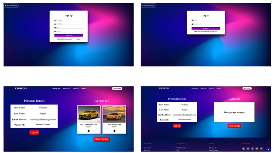

<body>
    
<h1>🚘 Car Dealership Web Application </h1>

This web app named 'KWheels' allows users to browse cars from a custom-built database, using various filtering and sorting options. Users have the ability to create an account, log in, and add their favorite cars to a personal garage. There is a FAQ section to help answer common questions, and if the user doesn't find what they're looking for, they can submit their own question through a contact form. There is also a loan calculator available to make it easier to estimate car financing.

<h3>Features</h3>

<ul>
    <li>Filtering cars by various attributes (brand, year, fuel type, performance, etc.)</li>
    <li>Sorting cars by data (year, price, mileage, etc.)</li>
    <li>Switching between multiple car images</li>
    <li>Registering a personal account through a validated form</li>
    <li>Logged-in users can add favorite cars to their garage</li>
    <li>Users can delete cars from their garage individually or clear the entire list at once</li>
    <li>Google Maps integration</li>
    <li>Animated FAQ section</li>
    <li>Form for submitting custom questions</li>
    <li>Loan calculator for faster and easier financing calculations</li>
    <li>User-friendly pop-up messages</li>
</ul>

<h3>Tech Stack</h3>

Front-End: HTML, CSS, Bootstrap, jQuery, JavaScript 

Back-End: PHP 

Database: MySQL 

<h3>Cars displayed</h3>

   
  

This section showcases the vehicles that are available for both purchase and rental. Users can easily browse through the listings using various filter and sorting options based on specific criteria. Each car is presented with high-quality images and detailed specifications to help users make informed decisions. The entire section was built using CSS for styling, PHP for backend logic, and SQL queries to fetch data from a MySQL database. The cars are dynamically displayed, allowing for real-time updates and seamless interaction with the content.

<h3>Question form</h3>

On the home page, there is a custom question submission form where users can ask their own questions. These messages are sent directly to the site administrator's email address provided in the backend. This feature was implemented using a PHP library called PHPMailer, which handles the secure and reliable sending of emails.

<h3>Loan Calculator</h3>

This section is to help users better and more quickly understand their financing options. By entering just a few details—such as the full price of the car, the interest rate, the down payment (either as an amount or a percentage), and the loan term—users can instantly calculate their estimated monthly installment. With the click of a button, the monthly payment is displayed. This feature was built using JavaScript and jQuery to ensure smooth and interactive functionality.

<h3>Contact Page</h3>

On the contact page, visitors can find a short description of the dealership's address, opening hours, and contact details. To make it easier for users to locate the dealership, an integrated Google Map is also included on the page.

<h3>User Account & Prolie</h3>

</body>

